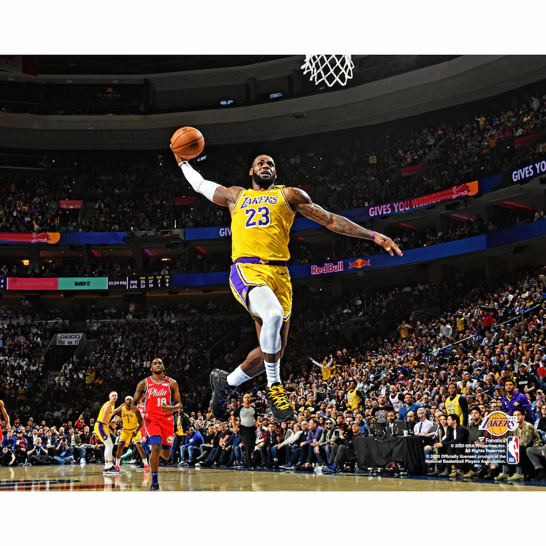

# CSE110 Lab1



## Myself
My name is Chris. I am originally from China then I went to high school in Pennsylvannia. I am a sophomore and majoring in Math-CS at UCSD. I love playing basketball and watch NBA. My **top 5 favorite player** are:
- **MJ**
- **Kobe**
- **Lebron James**
- **KD**
- **Kyrie Irving**  
  

If I were to rank them, the list would be:
1. **Lebron James**
2. **MJ**
3. **Kobe**
4. **KD**
5. **Kyrie Irving**
  

## As a sde
In terms of computer science, I have been learning computer science for a couple years now. My favorite language is python as it has very straightforward syntax like ```if n is 5``` or and is also very good for AI and ML. For more, you can find at [https://www.python.org](https://www.python.org).I took CSE 100 last quarter which I think is very interesting. We did a Huffman coding project and here is the file that conatined the "compress" function [Huffman coding](compress.cpp).  
I know there is still a long way to go to become a sde, so I have a checklist for me to finish that would get me closer to the goal:
- [x] write a project
- [] find a internship
- [] networking
- [] maybe master?  

To sum up, I have a quote to motivate me everyday:  
> Opportunities don't happen, you create them.  
  
  
  
  
  
[top](#cse110-lab1)